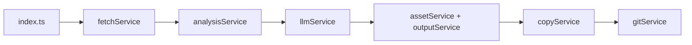

# ソース役割と処理の流れ

note → Zenn 向け Markdown 生成までを、**どのファイルが何をし、どの順で呼ばれるか**に沿って整理したメモです。

---

## 1. 全体像

- **言語**: TypeScript（ESM）。ビルド後は `dist/` の JavaScript を `node` で実行。
- **起動**: `src/index.ts` の `run()` が唯一のエントリ（CLI）。
- **データの中心**: `ParsedArticle`（`src/types/article.ts`）。HTML 取得後の解析結果と、LLM 入出力の土台になる。

---

## 2. エントリ: `src/index.ts`

| 役割 | 内容 |
|------|------|
| 引数 | 第1引数（または `--note-url=`）で **note 記事の URL** を受け取る。 |
| 設定読込 | `loadRuntimeConfig`（`.env`）と `loadConverterConfig`（`converter-config.json`）。 |
| LLM | `createLlmClient` で Ollama か OpenAI のクライアントを生成。 |
| 直列実行 | 下记の各ステップを **順番に 1 本道**で実行。失敗時は `process.exit(1)`。 |
| ログ | 各ブロックの前後で `logStepStart` / `logStepEnd`（`src/utils/logger.ts`）。 |

**ステップ名と対応する処理**（この順）:

1. **Initialize** — 設定・LLM クライアント
2. **Fetch** — note の HTML 取得
3. **Analysis** — HTML 解析 → `ParsedArticle`（本文・タグ・画像一覧）
4. **Inference** — `article.markdown` を LLM でリライト
5. **Download / Output** — 画像を `public/images/<slug>/` に保存、本文を `articles/<slug>.md` に書き出し
6. **Copy** — 同一記事を Zenn 用リポジトリへコピー
7. **Publish** — Zenn リポで `git add` / `commit` / `push`（条件付き）

最後に `Done: <articles 内のパス>` を表示。

---

## 3. パス定数: `src/utils/paths.ts`

| 定数 | 意味 |
|------|------|
| `projectRoot` | リポジトリルート（`src` から 2 段上）。 |
| `articlesDir` | 生成 Markdown の出力先: `articles/` |
| `publicImagesDir` | 画像のダウンロード先: `public/images/` |
| `promptPath` | システムプロンプト: `prompts/system_prompt.txt` |
| `converterConfigPath` | `converter-config.json` |

Docker 利用時はホストのプロジェクトが `/app` にマウントされ、上記はコンテナ内パスとして同じ構造になる。

---

## 4. 設定: `src/services/configService.ts`

| 関数 | 役割 |
|------|------|
| `loadRuntimeConfig` | 環境変数から実行時設定を読む。`LLM_PROVIDER`（`ollama` \| `openai`）、`ZENN_REPO_PATH`、`OPENAI_API_KEY`（OpenAI 時）などを検証。 |
| `loadConverterConfig` | `converter-config.json` が無ければデフォルトの `ConverterConfig`、あれば JSON を読み込む。 |

`.env` は `dotenv.config()` で読み込み（このファイル冒頭）。

---

## 5. 取得: `src/services/fetchService.ts`

| 項目 | 内容 |
|------|------|
| `fetchNoteHtml(url)` | `axios.get` で note 記事 URL の **HTML 文字列**を取得。 |
| エラー | 404 時は「プレースホルダ URL でないか」等を含むメッセージで `throw`。 |

**ここではまだ DOM も Markdown も扱わない**（生 HTML のみ）。

---

## 6. 解析の心臓: `src/services/analysisService.ts`

note の **1 ページ分の HTML** と **記事のベース URL** を受け取り、**`ParsedArticle` を組み立てる**。

### 6.1 タイトル・スラッグ

- `og:title` または `<title>` からタイトル。
- 末尾の `｜著者名` 風の部分を `sanitizeTitle` で削る。
- `toSlug`（`src/utils/markdown.ts`）で **スラッグ**化（ファイル名・パス用）。

### 6.2 画像

- `figure` / `img` を走査し、**ダウンロード可能な http(s) URL** を `imageMap` に登録（Renumber した `1.png` 等）。
- 本文中の `img` を `` 形式の **プレースホルダ文字列**に置換（のちローカル保存と整合）。
- **見出し画像**（`isNoteHeaderImage`）は `imageMap` に入れず、該当 `figure` / `img` を DOM から **削除**（本文・ダウンロードの両方から除外）。

### 6.3 本文テキスト化（LLM へ渡す `article.markdown`）

`article` 要素の `innerHTML` を `articleHtmlToMarkdownish` に渡し、**プレーンテキスト一択ではなく、Markdown 風の記法を混ぜた文字列**にする（実装の趣旨）:

- ` ` → 改行
- `<pre>` / `<code>`（言語は `class="language-xxx"` から推定可）→ フェンス / インラインコード
- `<strong>` / `<b>` → `**...**`
- `<a href>` → `[表示](絶対URL)`（`href` は `baseUrl` で解決）
- 最後に `text()` でタグを落とし、上記で挿入した `**` や `` などは **文字として残る**

### 6.4 タグ

- 上記で得た文字列から正規表現＋辞書で **技術風トークンを最大 5 件**（`extractTechnicalTags`）。Zenn の `tags` の元になる。

**成果物**: `title`, `slug`, `markdown`（LLM 入力用）, `tags`, `images`（ダウンロード用メタデータ）。

---

## 7. 推論: `src/services/llmService.ts`

| 項目 | 内容 |
|------|------|
| 役割 | `article.markdown` を **Zenn 向け本文**にリライトする。 |
| システム | `prompts/system_prompt.txt` を **1 ファイルまるごと** `role: "system"` に載せる。 |
| ユーザー | `buildUserPrompt` で `slug`・`converter_config`（JSON）・`few_shot_examples` 展開・`task`・`article:` ＋本文。 |
| 温度 | `INFERENCE_TEMPERATURE = 0` 固定（Ollama は `options.temperature`、OpenAI は `temperature`）。 |
| プロバイダ | Ollama: `POST {ollamaUrl}/api/chat`。OpenAI: `chat.completions.create`。 |

**返り値**: リライト済み **Markdown 本文のみ**（フロントマターは付けない）。

---

## 8. 画像: `src/services/assetService.ts`

| 項目 | 内容 |
|------|------|
| `downloadImages(article)` | `article.images` の `originalUrl` を GET し、`public/images/<slug>/<localFileName>` に保存。 |
| 失敗 | いずれかの画像で失敗したら `throw`（全体停止）。 |

---

## 9. 出力: `src/services/outputService.ts`

| 項目 | 内容 |
|------|------|
| `writeArticle(article, rewrittenMarkdown)` | フロントマター（`title`, `tags` 等）＋本文を結合し、`articles/<slug>.md` に書き込む。 |
| 前処理 | 本文先頭のタイトル重複除去、末尾の note 風タグ列除去、`:::message` 系の正規化（`normalizeMessageBlocks`）など。 |

**注意**: ローカル保存された画像パスは解析時点で既に `/images/<slug>/...` を指している想定。

---

## 10. Zenn リポへコピー: `src/services/copyService.ts`

| 項目 | 内容 |
|------|------|
| 記事 | `articles/<slug>.md` を `zennRepoPath/articles/<slug>.md` にコピー。 |
| 画像 | プロジェクト側 `public/images/<slug>/` → Zenn 側 **`images/<slug>/`**（GitHub 連携で本文の `/images/...` と一致させるため）。 |

`zennRepoPath` は `.env` の `ZENN_REPO_PATH`（Docker ではホストの `HOST_ZENN_REPO_PATH` がこのパスにマウントされる想定）。

---

## 11. Git 反映: `src/services/gitService.ts`

| 項目 | 内容 |
|------|------|
| `publishToZennRepo` | `articles/<slug>.md` と `images/<slug>/` だけを `git add`。 |
| 差分なし | `diff --cached --quiet` でスキップ（ログのみ）。 |
| コミット | `git -c user.name / user.email commit`（環境変数 `GIT_AUTHOR_*` で上書き可）。 |
| プッシュ | `GITHUB_TOKEN` があるとき HTTPS の `origin` に対し token 付き URL で `push`。無ければ通常の `git push`。 |

コンテナ内で `git` が必要（`Dockerfile` で `apk add git`）。

---

## 12. 型定義の置き場

| ファイル | 内容 |
|----------|------|
| `src/types/article.ts` | `ParsedArticle`, `ImageAsset` |
| `src/types/config.ts` | `ConverterConfig`, `ParameterSetting`, `FewShotExample`, `RuntimeConfig` |

---

## 13. 補助モジュール

| ファイル | 役割 |
|----------|------|
| `src/utils/logger.ts` | `[START] step` / `[END] step` |
| `src/utils/markdown.ts` | `toSlug`, `normalizeTag`（タイトル・タグ用） |

---

## 14. 設定ファイル（リポジトリ直下）

| ファイル | 役割 |
|----------|------|
| `converter-config.json` | 4 軸パラメータ・few-shot・`free_instruction`・`options`。推論時にそのままプロンプトへ JSON 埋め込み。 |
| `prompts/system_prompt.txt` | 全記事共通の編集ルール（LLM の system）。 |
| `.env` | `LLM_PROVIDER`, `ZENN_REPO_PATH`, API キー, `GITHUB_TOKEN` 等（gitignore 推奨）。 |

---

## 15. ビルドと実行コマンド（参考）

| コマンド | 意味 |
|----------|------|
| `npm run build` | `tsc` で `dist/` 生成。 |
| `npm run start` | `node dist/index.js`（ビルド後）。 |
| `npm run dev` | `tsx src/index.ts`（開発時）。 |
| `docker compose run --rm app npm run dev -- "<note URL>"` | コンテナ内で上記と同等（`.env` を読む）。 |

---

## 16. データが流れる場所の対応表（簡易）

| 段階 | 本文の姿 | 置き場所のイメージ |
|------|-----------|---------------------|
| Fetch 後 | 生 HTML | メモリのみ |
| Analysis 後 | プレーン寄り＋記法混じりの長文 | `article.markdown` |
| Inference 後 | Zenn 向けリライト済み MD | メモリ → `writeArticle` |
| Output 後 | フロントマター付き完成稿 | `articles/<slug>.md` |
| Copy 後 | 同上 | Zenn リポの `articles/<slug>.md` |
| Publish 後 | 同上がリモートへ | `git push` |

---

このドキュメントは **現時点のコードベースに基づく**ものです。ファイルを追加・改名した場合は、`src/index.ts` の import と本書の「サービス名」の対応を追えば追跡しやすくなります。
