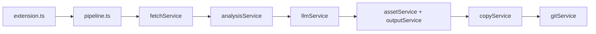

# ソース役割と処理の流れ

VSCode 拡張として動作する note2zenn の処理構造です。  
入口は `note URL` と `basename` の2つで、内部は従来の変換フローを維持しています。

## 1. 全体像

- **主要エントリ**: `src/extension.ts` + サイドバー `src/sidebarViewProvider.ts`
- **実行パイプライン**: `src/pipeline.ts`
- **LLM**: OpenAI 固定
- **設定**:
  - 通常設定: `note2zenn.*`（VSCode 設定）
  - 秘密情報: SecretStorage（OpenAI API キー、Git 情報）

## 2. 入口: サイドバー / `src/extension.ts`

Activity Bar の **Note2Zenn** Webview（`src/sidebarViewProvider.ts`）が主 UI。  
`src/note2zennController.ts` が設定・SecretStorage・変換実行を集約する。

コマンドパレットからも `Run Conversion` や Secret 設定が利用可能。

## 3. 実行本体: `src/pipeline.ts`

処理順:
1. **Initialize**: 設定検証 + LLM クライアント生成
2. **Fetch**: note HTML 取得
3. **Analysis**: HTML 解析と画像参照変換
4. **Inference**: OpenAI で本文リライト
5. **Download / Output**: 画像保存 + `articles/<basename>.md` 出力
6. **Copy**: `images/<basename>/` を Zenn リポへコピー
7. **Publish**: `git add` / `commit` / `push`

## 4. 設定関連

- `src/services/configService.ts`
  - `loadRuntimeConfig`: 必須値検証（OpenAI API キー、Zenn repo path）
  - `loadConverterConfig`: `note2zenn.converterConfig` を検証しデフォルト補完
- `package.json`
  - `contributes.configuration` に通常設定項目を定義

## 5. 各サービスの責務

- `fetchService.ts`: note URL から HTML 取得
- `analysisService.ts`: タイトル/タグ/画像/本文の解析
- `llmService.ts`: OpenAI への推論リクエスト
- `assetService.ts`: 画像ダウンロード（`public/images/<basename>/`）
- `outputService.ts`: Zenn 記事 Markdown 生成
- `copyService.ts`: 画像を Zenn リポへコピー
- `gitService.ts`: commit / push（SecretStorage 由来の Git 情報を利用）

## 6. 型

- `src/types/article.ts`: `ParsedArticle`, `ImageAsset`
- `src/types/config.ts`: `ConverterConfig`, `RuntimeConfig`, related types

## 7. 削除済みの旧構成

CLI エントリ（`src/index.ts`）、Docker 定義、`.env.example`、`converter-config.json` は廃止。設定は VSCode 拡張の設定 UI とサイドバーに集約。
