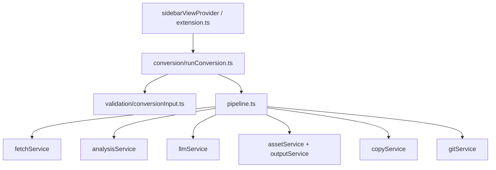

# ソースと処理の流れ

note2zenn のコード構成と、変換パイプラインの詳細です。  
使い方は [SETUP_AND_WORKFLOW.md](SETUP_AND_WORKFLOW.md)、免責は [DISCLAIMER.md](DISCLAIMER.md) を参照してください。

## 1. 全体像

```mermaid
flowchart TB
  UI[sidebarViewProvider / extension.ts]
  RUN[conversion/runConversion.ts]
  VAL[validation/conversionInput.ts]
  PL[pipeline.ts]
  UI --> RUN
  RUN --> VAL
  RUN --> PL
  PL --> F[fetchService]
  PL --> A[analysisService]
  PL --> L[llmService]
  PL --> AS[assetService + outputService]
  PL --> C[copyService]
  PL --> G[gitService]
```

| 層 | 役割 |
|----|------|
| UI | Activity Bar の Webview（`media/sidebar.html` + `sidebar.js`）、コマンドパレット |
| 設定 / Secret | `settings/workspaceSettings.ts`, `settings/secrets.ts` |
| 検証 | `validation/conversionInput.ts`（単一定義元） |
| 変換入口 | `conversion/runConversion.ts` |
| Pipeline | Fetch → Analysis → Inference → Output → Copy → Publish |
| Services | 各ステップの具体的処理 |

**廃止済み**: CLI（`src/index.ts`）、Docker、`docker-compose.yml`、`.env.example`、ルートの `converter-config.json`。設定は VSCode 設定と SecretStorage に集約。

## 2. エントリと UI

### `src/extension.ts`

- `activate`: サイドバー Webview の登録、コマンド登録
- コマンド: `focusSidebar`, `runConversion`, Secret 設定 4 種, `openSettings`
- 変換本体は `runConversionWithProgress` に委譲

### `src/sidebarViewProvider.ts`

- Webview ID: `note2zenn.sidebar`
- HTML: `media/sidebar.html`（`webview/loadSidebarHtml.ts` で読み込み）
- JS: `media/sidebar.js`（検証ロジックは持たず、ホストから `canRun` / `secretsError` を受け取る）

### `src/settings/`・`src/validation/`・`src/conversion/`

| モジュール | 内容 |
|------------|------|
| `workspaceSettings.ts` | `readSettings` / `saveSettings` |
| `secrets.ts` | SecretStorage の読み書き |
| `conversionInput.ts` | URL・Secret・basename の検証 |
| `runConversion.ts` | `executeConversion` / `runConversionWithProgress` |
| `output/outputChannel.ts` | Output チャンネル `Note2Zenn` |

## 3. パイプライン `src/pipeline.ts`

| ステップ | 処理 | 担当 |
|----------|------|------|
| Initialize | `loadRuntimeConfig`, `loadConverterConfig`, LLM クライアント生成 | `configService`, `llmService` |
| Fetch | note HTML を GET（15 秒タイムアウト） | `fetchService` |
| Analysis | HTML → `ParsedArticle` | `analysisService` |
| Inference | OpenAI で本文リライト + タグ生成（JSON `body`/`tags`、temperature 0） | `llmService` |
| Download / Output | 画像 DL + `articles/<assetDir>.md` 書き出し | `assetService`, `outputService` |
| Copy | `public/images/<assetDir>/` → Zenn リポ `images/<assetDir>/` | `copyService` |
| Publish | `git add` / `commit` / `push`（差分なしならスキップ） | `gitService` |

入力インターフェース: `RunConversionInput`（`noteUrl`, `runtimeConfig`, `converterConfig`, 任意 `analysisMarkdownBasename`）

## 4. 各サービス

### `fetchService.ts`

- `axios` で記事 URL を取得
- 404 時はプレースホルダ URL 向けの分かりやすいエラー

### `analysisService.ts`

- `cheerio` で HTML を解析
- タイトル正規化、著者名の除去
- 見出し画像（アイキャッチ）・末尾プロフィール画像の除外
- 本文を Markdown 化（` ` → ハード改行 `  \n`、`
` → 水平線 `---`）
- 画像 URL を `/images/<assetDir>/filename` 形式に変換
- `figcaption` → alt テキスト
- タグは Inference で OpenAI が生成（本ステップでは作らない）
- `assetDir`: サイドバーの basename → 未入力なら `defaultAnalysisBasename`（UI 経由で両方空なら controller がエラー。pipeline 直呼び時のみ slug フォールバック）

### `llmService.ts`

- `prompts/system_prompt.txt` を system メッセージに使用
- user メッセージ: `converter_config` JSON と `article:` 以下の解析済み Markdown
- モデル: `RuntimeConfig.openAiModel`（既定 `gpt-4.1-mini`）

### `assetService.ts`

- `public/images/<assetDir>/` に画像をダウンロード（拡張ルート基準）

### `outputService.ts`

- フロントマター: `title`, `emoji`, `type: tech`, **`published: false`**, `tags`
- LLM 出力から重複タイトル行・末尾 note タグ等を除去して結合
- 出力先: `<zennRepoPath>/articles/<assetDir>.md`

### `copyService.ts`

- 拡張内 `public/images/<assetDir>/` を Zenn リポ `images/<assetDir>/` へコピー

### `gitService.ts`

- stage: `articles/<assetDir>.md`, `images/<assetDir>/`
- 作者未設定時: `note2zenn-bot` / `note2zenn-bot@example.local`
- GitHub Token + HTTPS リモート時: `x-access-token` を URL に埋め込んで `git push <url> HEAD:<branch>`
- `safe.directory` を一時指定（権限・所有権エラー対策）

### `configService.ts`

- `loadRuntimeConfig`: `zennRepoPath`, `openAiApiKey` 必須
- `loadConverterConfig`: 欠損キーをデフォルト補完、`value` を 0〜1 に clamp。`rawConfig` がオブジェクトでない場合は全体デフォルト。

サイドバー側: 4 軸スライダー + `free_instruction` の入力を `run` メッセージで受け取り、実行直前に `buildConverterConfigFromForm` 経由で保存してから変換する。

## 5. 型定義

### `src/types/article.ts`

- `ParsedArticle`: `title`, `slug`, `assetDir`, `markdown`, `images`
- `ImageAsset`: `originalUrl`, `localFileName`, `localPath`, `altText`

### `src/types/config.ts`

- `ConverterConfig`: `logical_density`, `technical_focus`, `emotional_retention`, `politeness_level`, 任意 `free_instruction`, `options`
- `ParameterSetting`: `value` (0.0〜1.0)
- `RuntimeConfig`: API キー、モデル、Zenn パス、basename、Git 関連

## 6. ユーティリティ

| ファイル | 役割 |
|----------|------|
| `utils/paths.ts` | 拡張ルート、`public/images/`, `prompts/system_prompt.txt` |
| `utils/markdown.ts` | slug 化、タグ正規化、末尾画像除去など |
| `utils/logger.ts` | `[START]` / `[END]` ステップログ |

## 7. 設定の所在（`package.json`）

| キー | 保存先 | 説明 |
|------|--------|------|
| `note2zenn.zennRepoPath` | VSCode 設定 | Zenn リポの絶対パス |
| `note2zenn.openAiModel` | VSCode 設定 | OpenAI モデル名 |
| `note2zenn.defaultAnalysisBasename` | VSCode 設定 | 既定 basename |
| `note2zenn.converterConfig` | VSCode 設定 | 文体パラメータ |
| OpenAI / Git 系 | SecretStorage | コマンドまたはサイドバーから設定 |

## 8. ビルドとパッケージ

- `npm run build` → `tsc` で `dist/` に出力（`main`: `dist/extension.js`）
- `npm run package` → `vsce package`（`.vscodeignore` により `src/` は VSIX に含めず `dist/` のみ同梱）
- `engines.vscode`: `^1.95.0`

## 9. 関連ファイル（リポジトリ直下）

| パス | 用途 |
|------|------|
| `prompts/system_prompt.txt` | LLM の system プロンプト |
| `public/images/` | 画像の一時保存（実行時に `<basename>/` ができる） |
| `media/note2zenn.png` | Activity Bar アイコン |
